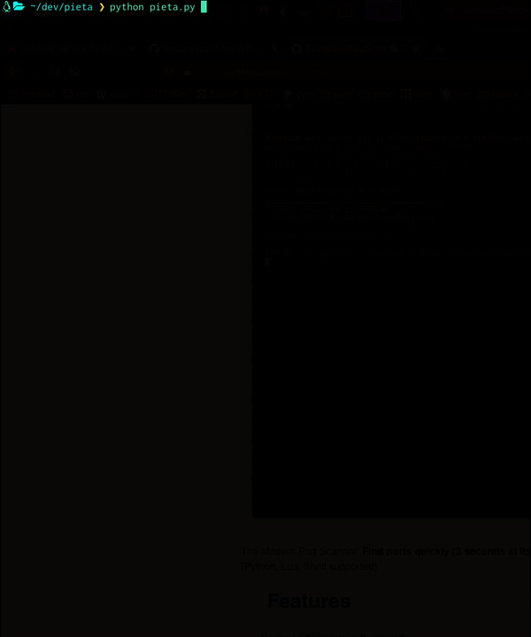
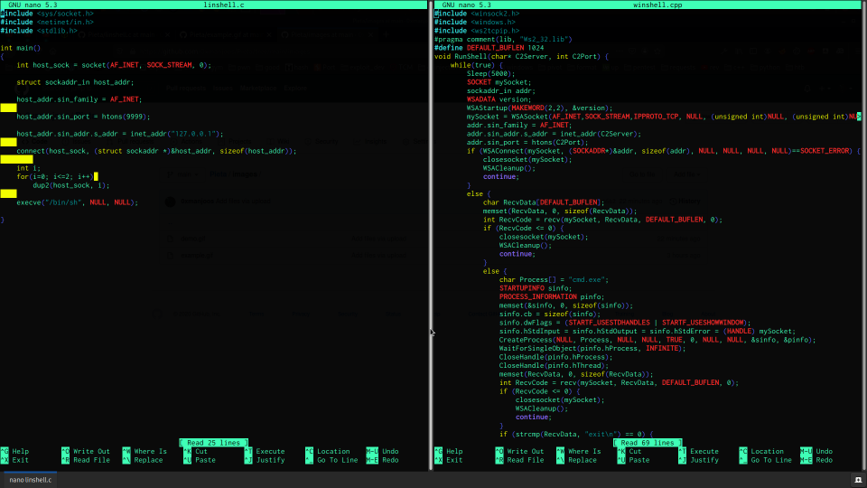

## Pieta Remote Access Tool  

### Features:

### ⚡ Interactive Command Prompt ⚡

### ⚡ Automated Enumeration ⚡
  

### ⚡ Custom 100% FUD Payloads ⚡

### Usage: 

#### ❯ chmod +x install.sh

#### ❯ ./install.sh

#### ❯ Pieta

